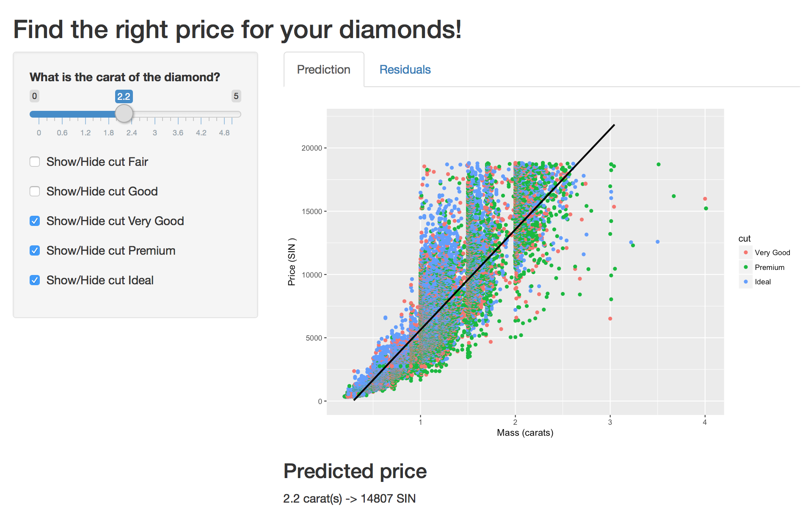
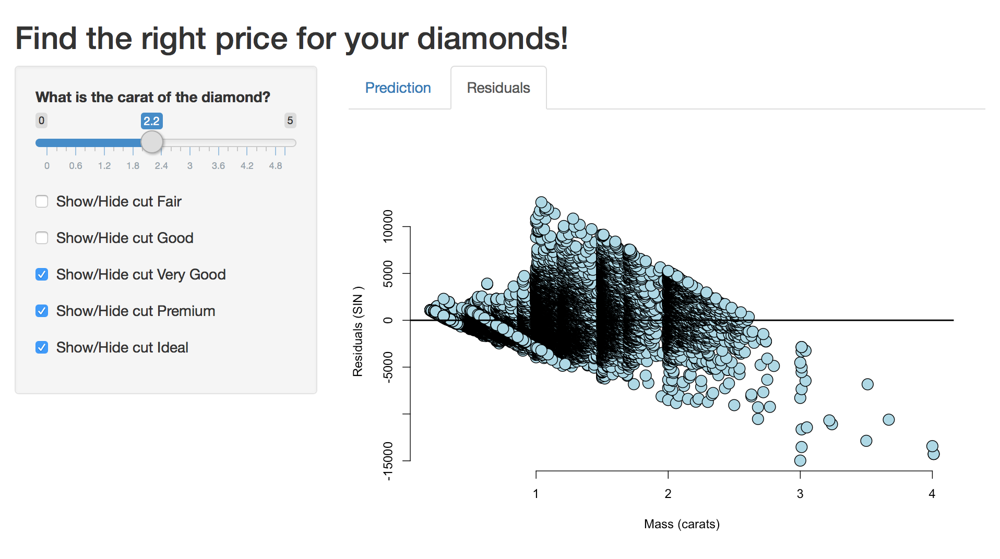

Course project: Developing Data Product
========================================================
author: Espen Svendsen 
date: 2017-12-27
autosize: true

Overview
========================================================

This presentation is the course project of [Developing Data Products](https://www.coursera.org/learn/data-products/home/info).

The data product developed in this course project is a Diamond Purchase Assistant

- Application host site: https://espensvendsen.shinyapps.io/shiny/
- Source code: https://github.com/espensvendsen/slidifyDataProduct

The Diamond Purchase Assistant
========================================================

Finally it's here: The *Diamond Purchase Assistant* uses a large data set of historical to aid your purchases! 

The set consists of prices of 50,000 round cut diamonds


```
     carat               cut        color        clarity     
 Min.   :0.2000   Fair     : 1610   D: 6775   SI1    :13065  
 1st Qu.:0.4000   Good     : 4906   E: 9797   VS2    :12258  
 Median :0.7000   Very Good:12082   F: 9542   SI2    : 9194  
 Mean   :0.7979   Premium  :13791   G:11292   VS1    : 8171  
 3rd Qu.:1.0400   Ideal    :21551   H: 8304   VVS2   : 5066  
 Max.   :5.0100                     I: 5422   VVS1   : 3655  
                                    J: 2808   (Other): 2531  
     depth           table           price             x         
 Min.   :43.00   Min.   :43.00   Min.   :  326   Min.   : 0.000  
 1st Qu.:61.00   1st Qu.:56.00   1st Qu.:  950   1st Qu.: 4.710  
 Median :61.80   Median :57.00   Median : 2401   Median : 5.700  
 Mean   :61.75   Mean   :57.46   Mean   : 3933   Mean   : 5.731  
 3rd Qu.:62.50   3rd Qu.:59.00   3rd Qu.: 5324   3rd Qu.: 6.540  
 Max.   :79.00   Max.   :95.00   Max.   :18823   Max.   :10.740  
                                                                 
       y                z         
 Min.   : 0.000   Min.   : 0.000  
 1st Qu.: 4.720   1st Qu.: 2.910  
 Median : 5.710   Median : 3.530  
 Mean   : 5.735   Mean   : 3.539  
 3rd Qu.: 6.540   3rd Qu.: 4.040  
 Max.   :58.900   Max.   :31.800  
                                  
```

Explore the predicted price
========================================================

- Select your carat and observe the predicted price (by means of linear regression)
- Drill and filter by quality of the cut 



Assert your risk taking by reviewing the residuals!
========================================================


